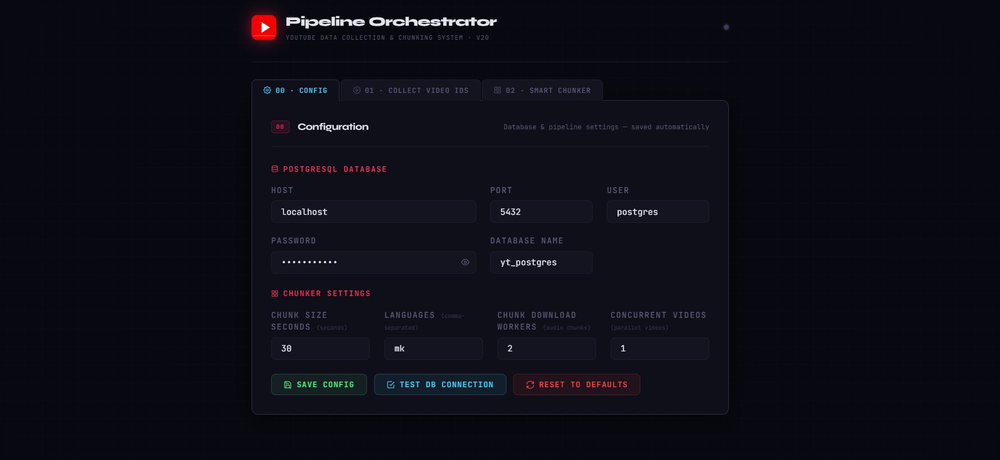
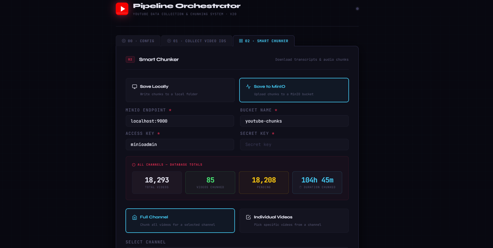
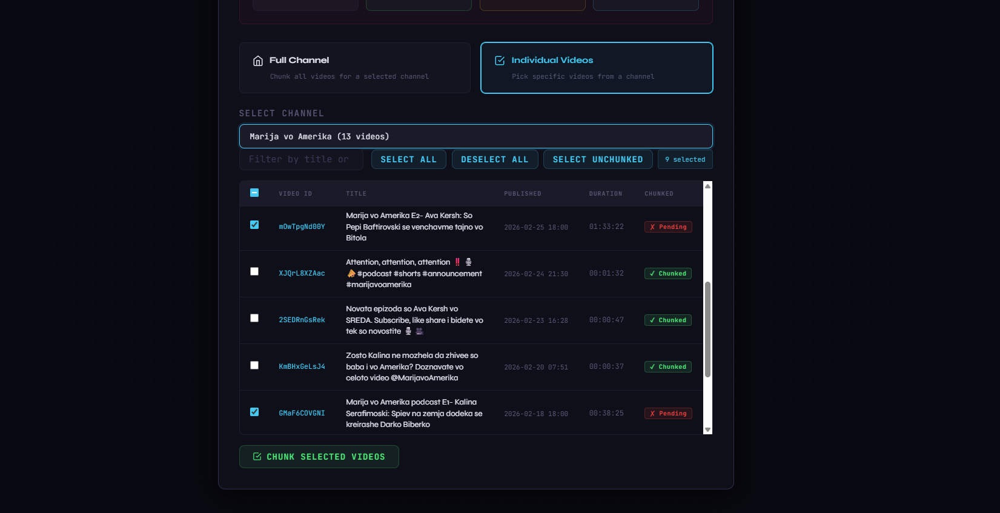

# YouTube Pipeline Orchestrator v20

A self-hosted web application for collecting YouTube video metadata, fetching transcripts, and chunking them into time-stamped segments — with either local filesystem or MinIO object storage output. Built on Flask + PostgreSQL.

All output is **Whisper-ready out of the box**: audio chunks are saved as 16 kHz mono WAV files and transcript text is automatically cleaned of `>>` speaker arrows at the time of writing — no separate preprocessing step needed.

---

## Table of Contents

- [Overview](#overview)
- [Prerequisites](#prerequisites)
- [Installation](#installation)
- [Configuration](#configuration)
- [Usage](#usage)
  - [Step 0 — Config](#step-0--config)
  - [Step 1 — Collect Video IDs](#step-1--collect-video-ids)
  - [Step 2 — Smart Chunker](#step-2--smart-chunker)
- [Storage Backends](#storage-backends)
- [Output Format](#output-format)
- [Project Structure](#project-structure)
- [Obtaining a YouTube Data API v3 Key](#obtaining-a-youtube-data-api-v3-key)
- [Installing ffmpeg](#installing-ffmpeg)
- [Setting Up MinIO](#setting-up-minio)
- [Troubleshooting](#troubleshooting)

---

## Overview

YouTube Pipeline Orchestrator automates the end-to-end process of building a structured, Whisper-ready audio dataset from any YouTube channel or set of individual videos.

**Pipeline at a glance:**

```
YouTube Channel / Video IDs
        │
        ▼
 [01] Collect Video IDs          ←  YouTube Data API v3  →  PostgreSQL
        │
        ▼
 [02] Smart Chunker              ←  youtube-transcript-api + yt-dlp
        │   ├─ strips >> speaker arrows from transcript text
        │   └─ converts audio to 16 kHz mono WAV (Whisper-ready)
        │
        ├──▶  Local Filesystem  (JSON + WAV per chunk)
        └──▶  MinIO Bucket      (same structure, cloud-ready)
```

---

## Prerequisites

Before installing Python dependencies, ensure the following are present on your system:

| Requirement | Version | Notes |
|---|---|---|
| Python | 3.10+ | |
| PostgreSQL | 13+ | Must be running and accessible |
| ffmpeg | Any recent | Required for audio extraction and WAV conversion |
| yt-dlp | Latest | Installed via pip (see below) |
| pydub | Latest | Installed via pip — used for MP3 → WAV conversion |

> **ffmpeg** must be installed at the **OS level**, not via pip.
> See [Installing ffmpeg](#installing-ffmpeg) below for platform-specific instructions.

> **PostgreSQL** must be running before you launch the app.
> Download: [https://www.postgresql.org/download/](https://www.postgresql.org/download/)

---

## Installation

```bash
# 1. Clone or unzip the project
cd yt_v20

# 2. Install all Python dependencies
pip install -r requirements.txt

# 3. Start the application
python app.py

# 4. Open in your browser
# http://localhost:5000
```

---

## Configuration

### Step 0 — Config

> 


The **Config** tab is the starting point. All settings are persisted to `config_user.json` and take effect immediately — no restart required.

| Field | Description | Default |
|---|---|---|
| `PG_HOST` | PostgreSQL host | `localhost` |
| `PG_PORT` | PostgreSQL port | `5432` |
| `PG_USER` | PostgreSQL user | `postgres` |
| `PG_PASSWORD` | PostgreSQL password | *(empty)* |
| `PG_DB` | Database name | `yt_postgres` |
| `CHUNK_SIZE` | Seconds per transcript chunk | `30` |
| `LANGS` | Transcript language codes (comma-separated) | `mk` |
| `MAX_WORKERS` | Parallel chunk-download threads per video | `2` |
| `MAX_VIDEO_WORKERS` | Videos processed in parallel | `1` |

**Test Connection** — Use the built-in button to verify your PostgreSQL credentials before running any pipeline step.

**Reset** — Reverts all fields to their defaults by deleting `config_user.json`.

---

## Usage

### Step 1 — Collect Video IDs

> 


This step queries the YouTube Data API v3 to retrieve all video IDs, titles, publish dates, and durations for a given channel, then stores them in your PostgreSQL database.

**Inputs required:**

- **YouTube Data API v3 Key** — See [Obtaining a YouTube Data API v3 Key](#obtaining-a-youtube-data-api-v3-key) below.
- **Channel URL** — any of the following formats are accepted:

```
https://www.youtube.com/@ChannelHandle
https://www.youtube.com/channel/UCxxxxxxxxxxxxxxxxxxxxxxxx
https://www.youtube.com/c/CustomName
https://www.youtube.com/user/Username
UCxxxxxxxxxxxxxxxxxxxxxxxx        ← raw channel ID
@ChannelHandle                    ← raw handle
```

**Behavior:**

- On first run, all videos in the channel are fetched and inserted.
- On subsequent runs, only **new** videos are added — already-stored videos are skipped via incremental detection (stops early after 25 consecutive known IDs).
- Duration is fetched for every new video using the `contentDetails` endpoint.

---

### Step 2 — Smart Chunker

> 

The **Smart Chunker** fetches transcripts and audio for every video collected in Step 1 and splits them into fixed-size chunks (default: 30 seconds each).

Each chunk produces:
- A **JSON file** with timestamped transcript entries, cleaned of `>>` speaker arrows
- A **WAV audio file** (16 kHz mono) extracted via `yt-dlp` + `ffmpeg` and converted to the exact format Whisper expects — no additional preprocessing required

#### Channel Mode vs. Individual Video Mode

| Mode | When to use | How to trigger |
|---|---|---|
| **Full Channel** | Process every un-chunked video in the channel | Leave video selection empty |
| **Individual Videos** | Process a specific subset of videos | Select videos from the channel table before running |

> 

#### IP-Ban Protection

The chunker has a built-in circuit breaker. All transcript requests are serialized (one at a time) with a configurable random delay between them (`RATE_GUARD_MIN`–`RATE_GUARD_MAX` seconds, default 4–8s). If 3 consecutive requests are blocked by YouTube, the run stops automatically and all successfully processed videos are saved.

#### Task Controls

Each chunker run is a background task with a live log stream. You can stop a running task at any time using the **Stop** button — all chunks already completed are kept.

---

## Storage Backends

### Local Filesystem

Output is written to a directory on your machine (default: `./youtubechunks`).

```
youtubechunks/
└── Channel_Name/
    └── Video_Title/
        ├── 0_0-30_0s.json
        ├── 0_0-30_0s_audio.wav
        ├── 30_0-60_0s.json
        ├── 30_0-60_0s_audio.wav
        └── ...
```

**Best for:** Local development, single-machine setups, or when you want direct filesystem access to chunks.

---

### MinIO Object Storage

Output is uploaded directly to a MinIO bucket. The same folder structure as local mode is used, but objects are stored under:

```
<bucket>/
└── Channel_Name/
    └── Video_Title/
        ├── 0_0-30_0s.json
        ├── 0_0-30_0s_audio.wav
        └── ...
```

**Best for:** Multi-machine setups, integration with ML training pipelines, or when you need S3-compatible object storage.

**MinIO-specific fields:**

| Field | Default | Description |
|---|---|---|
| `Endpoint` | `localhost:9000` | MinIO server address (no `http://`) |
| `Access Key` | `minioadmin` | MinIO root user or access key |
| `Secret Key` | `minioadmin` | MinIO root password or secret key |
| `Bucket` | `youtube-chunks` | Bucket name (created automatically if missing) |

See [Setting Up MinIO](#setting-up-minio) for installation instructions.

---

## Output Format

### JSON

Each `.json` chunk file contains an array of transcript entries. Speaker arrows (`>>`) are stripped automatically — the text is clean and ready for training:

```json
[
  {
    "text": "Здраво на сите денес",
    "start": 57.32,
    "duration": 5.879,
    "end": 60.519
  },
  {
    "text": "ќе одиме на прошетка во",
    "start": 60.519,
    "duration": 3.561,
    "end": 63.199
  }
]
```

### Audio

Each `_audio.wav` file is:

| Property | Value |
|---|---|
| Format | WAV (PCM) |
| Sample rate | 16 kHz |
| Channels | Mono |
| Ready for | Whisper fine-tuning directly — no conversion needed |

---

## Project Structure

```
yt_v20/
├── app.py                    # Flask backend — all API routes and SSE task runner
├── config.py                 # Config load / save / reset (reads config_user.json)
├── config_user.json          # User overrides (auto-generated, safe to delete)
├── db.py                     # Centralized PostgreSQL connection pool (ThreadedConnectionPool)
├── chunker_core.py           # Shared chunker engine: IP-ban protection, rate guard,
│                             #   transcript fetch + >> cleaning, chunking logic,
│                             #   DB helpers, audio download + WAV conversion
├── yt_chunked_db.py          # Local filesystem chunker (implements LocalBackend)
├── yt_chunked_db_minio.py    # MinIO chunker (implements MinioBackend)
├── youtube_api_db.py         # YouTube Data API collector (Step 1)
├── requirements.txt          # Python dependencies
├── templates/
│   └── index.html            # Single-page UI
├── static/
│   ├── script.js             # Frontend logic (SSE, task management, UI state)
│   └── style.css             # Styles
└── youtubechunks/            # Default local output directory
```

---

## Obtaining a YouTube Data API v3 Key

1. Go to [https://console.cloud.google.com/](https://console.cloud.google.com/) and sign in with a Google account.

2. Accept the Terms of Service if prompted.

3. Create a new project:
   - Click the project dropdown at the top → **New Project**
   - Give it a name (e.g., `youtube-pipeline`) and click **Create**

4. Enable the YouTube Data API v3:
   - In the left sidebar, go to **APIs & Services → Library**
   - Search for `YouTube Data API v3`
   - Click the result and press **Enable**

5. Create an API key:
   - Go to **APIs & Services → Credentials**
   - Click **Create Credentials → API key**
   - Copy the generated key

6. (Recommended) Restrict the key:
   - Click **Edit** on your new key
   - Under **API restrictions**, select **Restrict key** → choose `YouTube Data API v3`
   - Click **Save**

7. **Paste the key** into the YouTube API Key field in Step 1 of the application.

> ⚠️ The free quota is **10,000 units/day**.
> See quota costs at: https://developers.google.com/youtube/v3/getting-started

---

## Installing ffmpeg

ffmpeg must be installed at the OS level. It is **not** a Python package and cannot be installed via `pip`.

### Windows (Recommended — WinGet)

The fastest and cleanest way to install ffmpeg on Windows is via **WinGet**, the Windows Package Manager built into Windows 10/11.

Open **PowerShell** and run:

```powershell
winget install Gyan.FFmpeg
```

This installs ffmpeg and automatically adds it to your system `PATH`.

After installation, verify it works by opening a **new** PowerShell window and running:

```powershell
ffmpeg -version
```

> ⚠️ **Open a new terminal after installation.** WinGet updates your PATH, but the change only takes effect in newly opened terminal windows.

### Linux

```bash
sudo apt update
sudo apt install ffmpeg
ffmpeg -version
```

---

## Setting Up MinIO

> Video tutorial: https://www.youtube.com/watch?v=jlJHAI3nOFc&t=1s

MinIO is an open-source, S3-compatible object storage server. It runs as a single binary — no installer, no Docker required.

### Download

#### Windows

Download the MinIO server binary from:
**[https://www.min.io/download/aistor-server?platform=windows](https://www.min.io/download/aistor-server?platform=windows)**

Save `minio.exe` to a folder of your choice, e.g. `C:\minio\`.

#### Linux

```bash
wget https://dl.min.io/server/minio/release/linux-amd64/minio
chmod +x minio
sudo mv minio /usr/local/bin/
```

---

### Starting the Server

#### Windows

```powershell
.\minio.exe server C:\minio-data --console-address ":9001"
```

#### Linux

```bash
minio server ~/minio-data --console-address ":9001"
```

Once started you will see:

```
API: http://127.0.0.1:9000
WebUI: http://127.0.0.1:9001
```

Leave this terminal open — MinIO runs in the foreground.

---

### Changing the Default Credentials

By default, MinIO uses `minioadmin` / `minioadmin`. **Change these before storing any real data or exposing MinIO on a network.**

Set environment variables **before** starting the server:

#### Windows (PowerShell)

```powershell
$env:MINIO_ROOT_USER = "your_username"
$env:MINIO_ROOT_PASSWORD = "your_strong_password"
.\minio.exe server C:\minio-data --console-address ":9001"
```

#### Linux

```bash
export MINIO_ROOT_USER=your_username
export MINIO_ROOT_PASSWORD=your_strong_password
minio server ~/minio-data --console-address ":9001"
```

> ⚠️ The password must be **at least 8 characters** or MinIO will refuse to start.

After changing credentials, update the **Access Key** and **Secret Key** fields in the application's Smart Chunker tab to match.

---

### Default Credentials (unchanged)

| Field | Value |
|---|---|
| API Endpoint | `localhost:9000` |
| Web Console | `http://localhost:9001` |
| Root User | `minioadmin` |
| Root Password | `minioadmin` |

Open [http://localhost:9001](http://localhost:9001) to verify — if the MinIO console loads and you can see the **Buckets** section, the server is ready.

---
### Channel Examples
| Channel Name                          | Rating |
|---------------------------------------|--------|
| vasko eftov                           | 1      |
| snezhe velkov                         | 1      |
| infomaks                              | 1      |
| prva tv                               | 1      |
| bajkerot i krosfiterot                | 1      |
| mario arangelovski                    | 0      |
| boki 13                               | 0      |
| lazarov                               | 1      |
| stefanator                            | 0      |
| telma                                 | 1      |
| sitel                                 | 1      |
| kanal5                                | 1      |
| zivotna prikazna                      | 1      |
| Stars Show by Ivana Jankovska         | 0      |
| POPOVIC                               | 0      |
| Mimi Markovski                        | 0      |
| A1 ONmkd                              | 1      |
| BEZ RACNA                             | 0      |
| ALFA TV                               | 1      |
| Glamur Tv                             | 0      |
| hype tv mk                            | 0      |
| Televizija 24Vesti                    | 1      |
| bmg network                           | 1      |
| mandar                                | 0      |
| Backstage Media                       | 0      |
| Stef Steady                           | 1      |
| FUTURIVA                              | 0      |
| Ivan Nedelkovski                      | 1      |
| ZaSe Makedonija                       | 1      |
| Kanal 77                              | 1      |
| NextGen.Podcast                       | 1      |
| Ivan Ivanovski                        | 1      |
| Kako si? podkast                      | 1      |
| Pari                                  | 1      |
| Sto go vrti svetot                    | 1      |
| Dr. Chadikovski Podcast               | 1      |
| Tapshanov                             | 0      |
| Investigative Reporting Lab           | 1      |
| KOD Lupevska                          | 1      |
| Издиши се / Izdishi se                | 1      |
| Marija vo Amerika                     | 1      |
| Pocetna Presmetka                     | 1      |
| Makedonski koreni JB                  | 1      |
| Startup Revolution AI                 | 1      |
| nustarz                               | 1      |
| Bigorski Manastir                     | 1      |

## Troubleshooting

**`ffmpeg not found` error**
Install ffmpeg using the instructions in [Installing ffmpeg](#installing-ffmpeg) above. After installation, open a **new** terminal window before running the app — the PATH change will not apply to already-open terminals.

**`PostgreSQL connection refused`**
Ensure PostgreSQL is running (`pg_isready` on Linux/macOS, or check Services on Windows) and the credentials in the Config tab are correct. Use the **Test Connection** button to verify before starting any pipeline step.

**`No transcript found` for many videos**
The video has no available transcript in the language(s) configured in `LANGS`. Videos with no transcript are automatically removed from the database. Add additional language codes (e.g., `en,mk,de`) to broaden the search.

**YouTube is blocking your IP**
The chunker has a built-in IP-ban circuit breaker. If 3 consecutive transcript requests are blocked, the run stops automatically and all successfully processed videos are saved. Wait several hours before retrying, or use a different network or VPN.

**`yt-dlp` fails to download audio**
Run `yt-dlp --update` to ensure you have the latest version. YouTube frequently changes its internal API, and yt-dlp releases fixes regularly.

**WAV conversion fails / `pydub` error**
Ensure `pydub` is installed (`pip install pydub`) and that `ffmpeg` is available on your PATH. pydub uses ffmpeg internally to decode MP3 before converting to WAV — if ffmpeg is missing, pydub will fail.

**MinIO server exits immediately on Windows**
Ensure `MINIO_ROOT_PASSWORD` is at least 8 characters. A password that is too short will cause MinIO to exit with an error at startup.

**Channel URL not resolving**
The app supports handles (`@name`), channel IDs (`UCxxx`), `/c/`, `/user/`, and full URLs. If resolution fails via page scraping, it falls back to the YouTube API automatically. Make sure your API key is valid and has the YouTube Data API v3 enabled.

---

*YouTube Pipeline Orchestrator v20*
